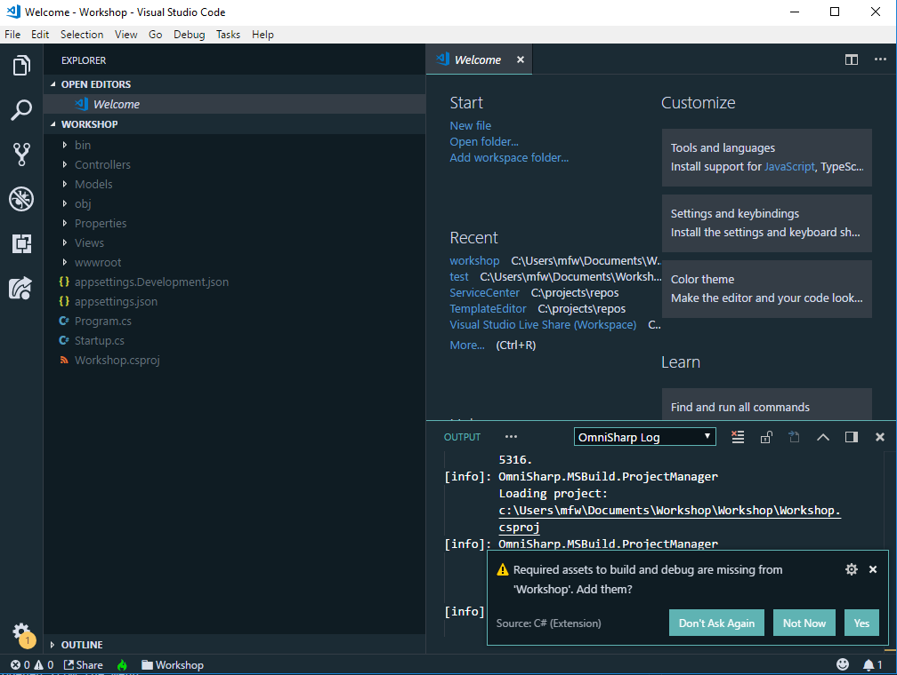

# Workshop Tromsø 20.09.2018

An ASP.net Web app running in containers orchestrated by Docker Compose

## Prerequisites

- Install the latest version of .Net Core.
- Install the latest version of Docker, using the edge channel.
- TODO: Run the empty build and runtime container

## Part 1: Anatomy of an ASP.Net Web App

In this part you will create a simple ASP.Net web app and web API, familiarising yourself with their architectures.

### Create app from template

- `mkdir Workshop`
- `cd Workshop`
- `dotnet new mvc`

### Use Visual Studio Code to develop and debug

- `code .`

- Press *yes*.
- `Shift + CMD + B` to build
- `F5` to debug
- You should see the default ASP.Net website template running in your browser.

### Get to know ASP.Net

- Static resources
- Model View Controller
- Dependency Injection
- Configuration
- Routes
- Request pipeline

### Implement an actual app

Now you'll add a simple 2048 game and high score services. 

#### Create HTML5 game

- Add the content of the `Game` folder to the `wwwroot` folder.
- Verify that the game runs on [https://localhost:5001/Game.html](https://localhost:5001/Game.html).

#### Link game from example site

- Add `<li><a href="Game.html">Game</a></li>` to `_Layout.cshtml`.
- Verify that the game can be opened from the menu 

#### Create High Score service

- Create the interface of a simple high score service, `IHighScoreService`.
- Implement it in `HighScoreService`.
- Add it as a singleton to the service collection in `Startup`.
- Create `HomeController`. Check that it works by visiting [https://localhost:5001/api/highscore](https://localhost:5001/api/highscore).

#### Integrate High Score service

## Part 2: Local machine ain't good enough

## Part 3: Divide and conquer

